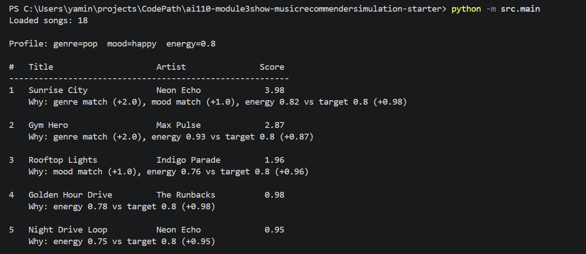

# 🎵 Music Recommender Simulation

## Project Summary

In this project you will build and explain a small music recommender system.

Your goal is to:

- Represent songs and a user "taste profile" as data
- Design a scoring rule that turns that data into recommendations
- Evaluate what your system gets right and wrong
- Reflect on how this mirrors real world AI recommenders

Replace this paragraph with your own summary of what your version does.

---

## How The System Works

When Spotify tells you "you might also like this," it has two ways of figuring that out. One way is to look at what other people with similar taste have been listening to — if thousands of people who love the same artists as you also love a certain song, it figures you probably will too. The other way is to look at the song itself — its tempo, its energy, whether it feels happy or dark — and ask how closely that matches what you usually enjoy. Real platforms blend both approaches and also factor in things like what time of day it is or what device you are on.

This simulation keeps things simple and focuses entirely on the second approach: matching song attributes to a user's stated preferences. There is no user history, no crowdsourced behavior, and no mystery black box. Every recommendation comes with a clear reason, and every decision in the scoring is something you can read and adjust directly in the code.

Every song in this system carries the following information:

- **Genre** — the broad style of the track, like pop, lofi, jazz, or ambient
- **Mood** — the emotional feel, like happy, chill, intense, focused, or moody
- **Energy** — how intense or active the song feels, on a scale from 0 (very calm) to 1 (very intense)
- **Tempo** — the speed of the track in beats per minute
- **Valence** — how musically positive or uplifting the song sounds, from 0 (dark) to 1 (euphoric)
- **Danceability** — how well the rhythm and beat lend themselves to dancing, from 0 to 1
- **Acousticness** — how acoustic versus electronic the song sounds, from 0 (fully produced) to 1 (fully acoustic)

Instead of tracking what you have listened to, the system asks you four questions up front:

- **What is your favorite genre?** — used to check whether a song fits your usual style
- **What mood are you in?** — used to check whether the song's emotional tone matches how you feel right now
- **How much energy do you want?** — a number from 0 to 1 representing the intensity level you are looking for
- **Do you prefer acoustic music?** — a yes or no that influences whether electronic or acoustic tracks score higher for you

### How it picks what to recommend

The system looks at every song in the catalog one at a time and gives each one a score. Once all songs have been scored, it sorts them from highest to lowest and hands you back the top results. Here is exactly how that score is calculated.

**The Algorithm Recipe**

Every song starts at zero points. Then the system asks three questions in order:

First, does the song's genre match your favorite genre? If yes, the song earns two points. This is the biggest single reward in the system, because genre is treated as the clearest signal of whether a song belongs in your world at all.

Second, does the song's mood match the mood you told the system you are in right now? If yes, the song earns one more point. Mood matters, but it is weighted lower than genre because the same emotional feel can show up across many different styles, so it is a softer signal.

Third, how close is the song's energy level to the energy you asked for? Energy is a number between zero and one. The system subtracts the difference between the song's energy and your target from one, giving you a closeness score that also falls between zero and one. A song with energy 0.41 when your target is 0.40 scores nearly a full point here. A song with energy 0.90 when your target is 0.40 scores only 0.50. There is no hard cutoff — every song gets some credit, just more or less depending on how close it is.

Add those three numbers together and you have the song's final score. The maximum anyone can earn is 4.0, which would mean a perfect genre match, a perfect mood match, and an exact energy fit all at once.

**Potential Biases to Watch For**

Because genre carries twice the weight of mood, this system can over-reward stylistic familiarity at the expense of emotional fit. Imagine you are in a happy, energetic mood but your favorite genre is lofi — a genre that skews calm and quiet. The system might still rank a focused lofi track above an upbeat pop song that actually matches how you feel right now, simply because the genre label lines up. Great songs that fit your mood but live in an unfamiliar genre will almost always lose to a mediocre song in your preferred genre.

The catalog is also very small, with only eighteen songs spread across eleven genres. Several genres have only one or two representatives, so if your favorite genre happens to be one of them, the system has almost nothing to work with and the genre bonus rarely fires. Meanwhile, genres like lofi and pop have more entries, so users who prefer those styles get a richer pool to rank from.

Finally, the system has no memory and no nuance. It treats "lofi" as a single category even though lofi for studying and lofi for sleeping feel quite different in practice. And it takes your stated preferences at face value — if you say your favorite genre is rock but you have been listening to jazz all week, the system has no way to know that.

---

## Getting Started

### Setup

1. Create a virtual environment (optional but recommended):

   ```bash
   python -m venv .venv
   source .venv/bin/activate      # Mac or Linux
   .venv\Scripts\activate         # Windows

2. Install dependencies

```bash
pip install -r requirements.txt
```

3. Run the app:

```bash
python -m src.main
```

### Running Tests

Run the starter tests with:

```bash
pytest
```

You can add more tests in `tests/test_recommender.py`.

---

## Experiments You Tried

Use this section to document the experiments you ran. For example:

- What happened when you changed the weight on genre from 2.0 to 0.5
- What happened when you added tempo or valence to the score
- How did your system behave for different types of users



---

## Limitations and Risks

Summarize some limitations of your recommender.

Examples:

- It only works on a tiny catalog
- It does not understand lyrics or language
- It might over favor one genre or mood

You will go deeper on this in your model card.

---

## Reflection

Read and complete `model_card.md`:

[**Model Card**](model_card.md)

Write 1 to 2 paragraphs here about what you learned:

- about how recommenders turn data into predictions
- about where bias or unfairness could show up in systems like this


---

## 7. `model_card_template.md`

Combines reflection and model card framing from the Module 3 guidance. :contentReference[oaicite:2]{index=2}  

```markdown
# 🎧 Model Card - Music Recommender Simulation

## 1. Model Name

Give your recommender a name, for example:

> VibeFinder 1.0

---

## 2. Intended Use

- What is this system trying to do
- Who is it for

Example:

> This model suggests 3 to 5 songs from a small catalog based on a user's preferred genre, mood, and energy level. It is for classroom exploration only, not for real users.

---

## 3. How It Works (Short Explanation)

Describe your scoring logic in plain language.

- What features of each song does it consider
- What information about the user does it use
- How does it turn those into a number

Try to avoid code in this section, treat it like an explanation to a non programmer.

---

## 4. Data

Describe your dataset.

- How many songs are in `data/songs.csv`
- Did you add or remove any songs
- What kinds of genres or moods are represented
- Whose taste does this data mostly reflect

---

## 5. Strengths

Where does your recommender work well

You can think about:
- Situations where the top results "felt right"
- Particular user profiles it served well
- Simplicity or transparency benefits

---

## 6. Limitations and Bias

Where does your recommender struggle

Some prompts:
- Does it ignore some genres or moods
- Does it treat all users as if they have the same taste shape
- Is it biased toward high energy or one genre by default
- How could this be unfair if used in a real product

---

## 7. Evaluation

How did you check your system

Examples:
- You tried multiple user profiles and wrote down whether the results matched your expectations
- You compared your simulation to what a real app like Spotify or YouTube tends to recommend
- You wrote tests for your scoring logic

You do not need a numeric metric, but if you used one, explain what it measures.

---

## 8. Future Work

If you had more time, how would you improve this recommender

Examples:

- Add support for multiple users and "group vibe" recommendations
- Balance diversity of songs instead of always picking the closest match
- Use more features, like tempo ranges or lyric themes

---

## 9. Personal Reflection

A few sentences about what you learned:

- What surprised you about how your system behaved
- How did building this change how you think about real music recommenders
- Where do you think human judgment still matters, even if the model seems "smart"

